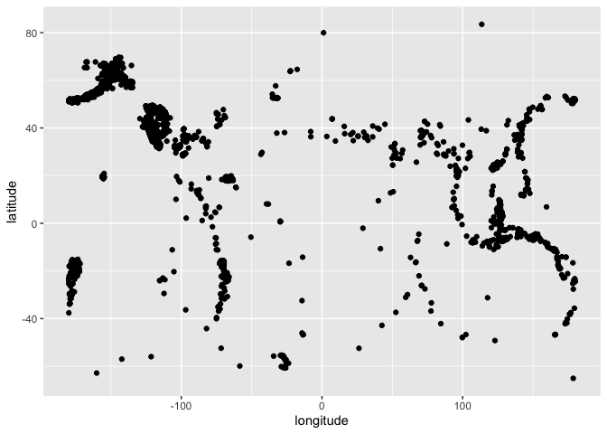

<!-- README.md is generated from README.Rmd. Please edit that file -->

# scrapers

<!-- badges: start -->

[](https://github.com/stat-assignments/scrapers/actions/workflows/R-CMD-check.yaml)
[](https://app.codecov.io/gh/stat-assignments/scrapers)
<!-- badges: end -->

The goal of scrapers is to …

## Installation

You can install the development version of scrapers like so:

``` r
remotes::install_github("stat-assignments/scraper")
```

## Example

This is a basic example which shows you how to solve a common problem:

``` r
library(scrapers)
library(tidyverse, quietly = TRUE)
#> ── Attaching core tidyverse packages ──────────────────────── tidyverse 2.0.0 ──
#> ✔ dplyr     1.1.4     ✔ readr     2.1.5
#> ✔ forcats   1.0.0     ✔ stringr   1.5.1
#> ✔ ggplot2   3.5.1     ✔ tibble    3.2.1
#> ✔ lubridate 1.9.3     ✔ tidyr     1.3.1
#> ✔ purrr     1.0.4     
#> ── Conflicts ────────────────────────────────────────── tidyverse_conflicts() ──
#> ✖ dplyr::filter() masks stats::filter()
#> ✖ dplyr::lag()    masks stats::lag()
#> ℹ Use the conflicted package (<http://conflicted.r-lib.org/>) to force all conflicts to become errors
## basic example code

eq <- get_earthquakes(lubridate::today()-30, lubridate::today())
eq %>% ggplot(aes(x = longitude, y = latitude)) + geom_point()
```


